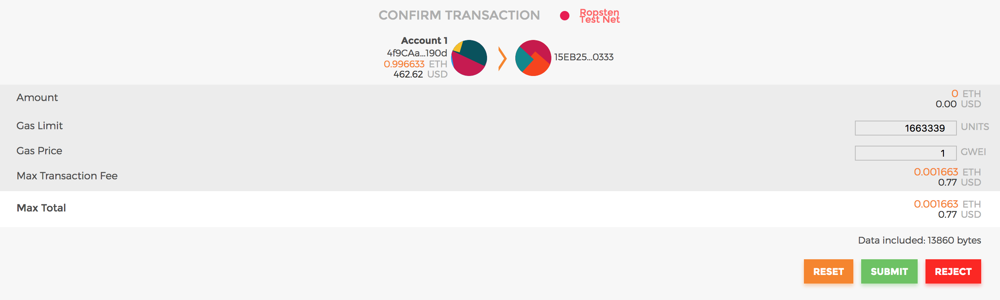
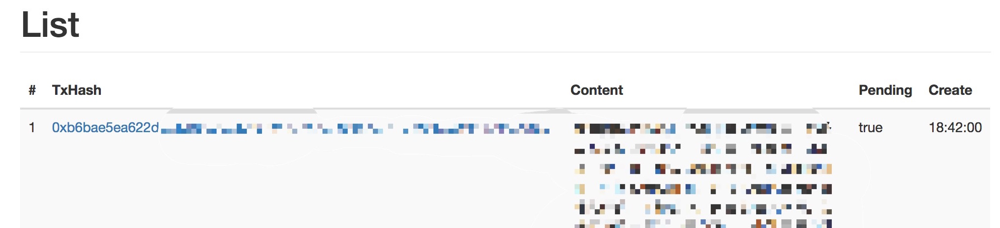

# Dinfo

Dinfo is a tiny DApp on Ethereum to publish or view infomation. No blockchain knowledge is needed to use this tool. Just be aware that what you publish through this tool is fully **ANONYMOUS**, visible to **EVERYONE** around the world, and **CANNOT** be modified or deleted as long as Ethereum is running. So **PLEASE** do not publish harmful, slanderous, or fake information.

For those who want to publish some information, it takes a little time, effort and of course, money. I do not gain from the project, the price is paid to the miners on Ethereum. Usually it only takes <10 Yuan to publish a piece of information, according to the length of your message.

For those who want to view information, you don't need to pay anything.

## User's Guide

You only need a computer and a VPN to use this tool.

#### Step 1: Install MetaMask

Follow the tutorials on [MetaMask](www.metamask.io) to install and create an account on Main Network. Please keep safe of your account.

#### Step 2: Buy or transfer some ETH (for publishers)

Note that if you only want to view messages you don't need to spend any ETH, just skip to next step.

You can either buy some ETH through MetaMask, or transfer some from one of your other Ethereum addresses. If the above methods does not apply, you can buy some from Exchanges like [Huobi](huobi.pro), then draw them out to your MetaMask address. Please refer to their user's guides and do it safely.

You can check your ETH balance in MetaMask now.

#### Step 3: Download and run

Download the project, choose one binary file among `dinfo/dinfo_*`  according to your Operating System and run it.

#### Step 4: Publish

If you only want to view information, skip this step.

##### Create

In "Create" page, input your message in the box, then click create button. There will be a new window popped up by MetaMask for you to confirm about the transaction (the message you inputed will be sent to Ethereum as a transaction).

##### Submit

Normally you do not need to modify any parameters in the window, just press submit button. Note that if your ETH balance is less than estimated transaction fee, the transaction may fail.

##### Wait
After you submit the information, the browser will jump to the "List" page, which shows all of the messages you ever made. The "Pending" column means the transaction is being verified by miners on Ethereum. You can refresh the page to see whether if it's still pending. It may take a few moment (normally several minutes) to let the transaction be accepted by Ethereum. Please stay patient.

##### Share

Once the transaction is done, you can click the link on the TxHash (the ID of the transaction) to check it on Etherscan, the block explorer of Ethereum. You can also copy the TxHash and share it with other people. 

#### Step 5: View

In the "Search" page, you can input a TxHash of other people's message and press search button to view the content.

By clicking on the link of TxHash, you can view the transaction details on Etherscan. On that page, you can also view the content by changing the "View input as" to "UTF-8" at input Data box.

## Contract code

For those who is curious about how this works, you can refer to the contract code `contract.sol` included in this project, or [on Etherscan](https://etherscan.io/address/0x6d105976d1a93e1ce23b825b562519144a56d7a4). It's very tiny but efficient, and please feel free to report issues if there are problems about the contract.

## Further Plan

A more useful feature is planned but not implemented due to limited time, which is to view all the transaction that has ever been sent through the contract. With that feature, you can quickly scan all the messages sent by other people and learn much more.

## Credits

The idea of this DApp is inspired by some discussions I had a long time ago with @ExplorerFreda, althrough she decided it was a bad idea. The direct reason I want to get this done as fast as possible is that, upon recent events happening around us, the social media is being muzzled to a more intolerable extent. I want to provide a tool for those who desperately want their stories to be heard so that they are no longer muted.

I think this tool is worth a try to build an open space for speaking truth, althrough I am fully aware that after some time it may bring other things we don't want. Still, blockchain has its power and its drawbacks, like any other technologies. To observe how this tool will be used by people is also an interesting experiment on humanity.

Thanks @sswsdsn a lot for supporting me on building the server and frontend (literally 99% percent of the project coding)!
