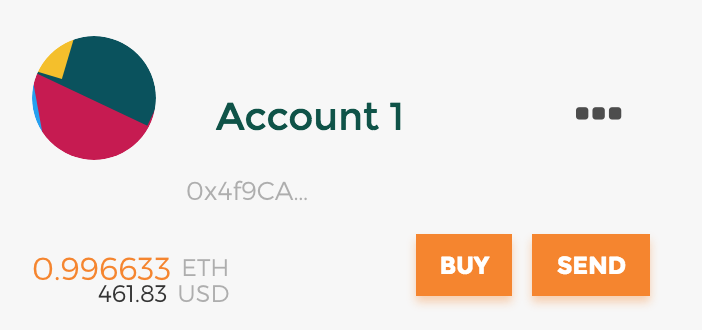

# Dinfo

Dinfo is a tiny DApp on Ethereum to publish or view infomation. No blockchain knowledge is needed to use this tool. Just be aware that what you publish through this tool is fully **ANONYMOUS**, visible to **EVERYONE** around the world, and **CANNOT** be modified or deleted as long as Ethereum is running. So **PLEASE** do not publish harmful, slanderous, or fake information.

For those who want to publish some information, it takes a little time, effort and of course, money. I do not gain from the project, the price is paid to the miners on Ethereum. Usually it only takes <10 Yuan to publish a piece of information, according to the length of your message.

## User's Guide 用户指南

Those who only want to view information can directly skip to the last step. For publishers, you will need a computer and a VPN to use this tool.

对于只想阅读的用户，只需跳转到最后一步即可。对于发布者，需要有VPN，并进行以下步骤。

### Step 1: Install MetaMask 安装MetaMask

Follow the tutorials on [MetaMask](https://metamask.io) to install and create an account on Main Network. Please keep safe of your account.

跟随[MetaMask](https://metamask.io)网站的官方指南安装MetaMask插件，并创建一个在以太坊主网上的账号。请妥善保存账号。

### Step 2: Buy or transfer some ETH 购买或转入ETH

You can either buy some ETH through MetaMask, or transfer some from one of your other Ethereum addresses. If the above methods does not apply, you can buy some from Exchanges like [Huobi](https://huobi.pro), then draw them out to your MetaMask address. Please refer to their user's guides and do it safely.

ETH是购买以太坊服务的唯一货币。可直接通过从MetaMask购买，或者从其他以太坊地址转账的方式给你的地址充值。如果两者都不适用，可以在交易所如[火币](https://huobi.pro)通过法币交易购买少量ETH，并通过提币操作转出ETH到MetaMask钱包的地址。

You can check your ETH balance in MetaMask now. 转账成功后可以在MetaMask中查看ETH余额。

### Step 3: Download and run 下载和运行

Download the project, choose one binary file among `dinfo/dinfo_*`  according to your Operating System and run it. When binary is running, open your browser and go to `localhost:8089`. Make sure your MetaMask is open when you use the tool.

下载这个项目，在`dinfo/dinfo_*`这几个可执行文件中选择一个适用于你的系统的，运行它。当它运行时，打开你的浏览器前往`localhost:8089`。请确保在使用Dinfo的时候MetaMask一直打开。

### Step 4: Publish 发布内容

#### 4.1 Create 创建

In "Create" page, input your message in the box, then click create button. There will be a new window popped up by MetaMask for you to confirm about the transaction (the message you inputed will be sent to Ethereum as a transaction).

在Create页面，将想要发布的内容键入文本框（只支持纯文本），点击create按钮。MetaMask将会自动弹窗，要求你确认你的交易（你的消息将以交易的形式发送给以太坊）。

#### 4.2 Submit 提交

Normally you do not need to modify any parameters in the window, just press submit button. Note that if your ETH balance is less than estimated transaction fee, the transaction may fail. This transaction fee is likely how much you will spend on publishing this message. Again, the ETH you spend goes to miners on Ethereum.

正常来说你不需要修改这个窗口里的任何内容，直接点击submit按钮提交交易即可。注意如果你的ETH余额小于预估的手续费，你的交易可能失败。这个手续费就是你需要为这条消息付出的价格。重申，这个手续费最终会交给以太坊上的矿工。

#### 4.3 Wait 等待

After you submit the information, the browser will jump to the "List" page, which shows all of the messages you ever made. The "Pending" column means the transaction is being verified by miners on Ethereum. You can refresh the page to see whether if it's still pending. It may take a few moment (normally several minutes) to let the transaction be accepted by Ethereum. Please stay patient.

提交之后，浏览器会跳转到List页面，这个页面中是你使用Dinfo发送的所有交易列表。Pending列显示你的交易是否在等待被以太坊的矿工验证，你可以刷新页面以查看它是否还在等待。这个过程通常需要几分钟，取决于以太坊网络拥堵情况，请耐心等待。

#### 4.4 Share 分享

Once the transaction is done, you can click the link on the TxHash (the ID of the transaction) to check it on Etherscan, the block explorer of Ethereum. You can also copy the TxHash or url of the page on Etherscan and share it with other people. 

交易成功后，你可以点击TxHash（交易的ID）列的链接，在Etherscan上查看这笔交易。Etherscan是以太坊的浏览器。你可以复制你的交易TxHash或者Etherscan链接的网址给他人查看。

### Step 5: View 查看

There are two ways to view information published. Currently the two way can achieve the same thing, but after Dinfo is upgraded with more features, it will be more excited to view with Dinfo.

有两种方法查看已发布的信息。当前，两种方式可以完成同样的功能，待Dinfo升级到更多功能，将会更好用。

#### 5.1 View on Etherscan 在以太坊浏览器上查看

In this way you need not install anything. Simply open a transaction address on Etherscan (which is created by publishers and somehow shared to you), like this [test msg](https://etherscan.io/tx/0xcd54e3f3ef31fa94114a19963303d7f9a92a45f5ccda8120b97b1908f5d0cf4c). There is an Input Data box at the bottom, it looks confusing with only hex codes, but you can view the true content by changing the "View input as" to "UTF-8".

使用这种方法，无需安装任何东西。只需打开一个以太坊浏览器上的交易地址（他人发布内容后分享给你的地址），例如这个[测试内容](https://etherscan.io/tx/0xcd54e3f3ef31fa94114a19963303d7f9a92a45f5ccda8120b97b1908f5d0cf4c)。在页面底端有一个Input Data框，里面的内容看起来是无聊的十六进制码，但通过改变"View input as"选项到"UTF-8"，你可以看到它的实际内容。

#### 5.2 View from Dinfo 使用Dinfo查看

To view information from Dinfo, you need to install MetaMask in Step 1, and download and run Dinfo in Step 3. In the "Search" page, you can input a TxHash of other people's message and press search button to view the content.

如果使用Dinfo查看，首先需要第一步的MetaMask，以及第三步的安装和运行。在Search页面，你可以输入一个他人分享给你的TxHash，点击Search按钮，查看它的内容。

## Further Plan 后续计划

A more useful feature is planned but not yet implemented due to limited time, which is to access to all the transactions that have ever been sent through the contract. With that feature, you can quickly browse all the messages sent by other people and learn much more. It will be implemented into Dinfo as soon as possible.

时间关系，Dinfo一个重要的功能还未实现：直接访问到所有通过Dinfo发送的内容。用户可以沿着时间线看到所有其他人发送的内容，获取更多信息。该功能将会尽快进入Dinfo，敬请期待。

## Contract code

For those who is curious about how this works, you can refer to the contract code `contract.sol` included in this project, or [on Etherscan](https://etherscan.io/address/0x6d105976d1a93e1ce23b825b562519144a56d7a4). It's very tiny but efficient, and please feel free to report issues if there are problems about the contract.

## Credits

The idea of this DApp is inspired by some discussions I had a long time ago with @ExplorerFreda, althrough she decided it was a bad idea. The direct reason I want to get this done as fast as possible is that, upon recent events happening around us, the social media is being muzzled to a more intolerable extent. I want to provide a tool for those who desperately want their stories to be heard so that they are no longer muted.

I think this tool is worth a try to build an open space for speaking truth, althrough I am fully aware that after some time it may bring other things we don't want. Still, blockchain has its power and its drawbacks, like any other technologies. To observe how this tool will be used by people is also an interesting experiment on humanity.

Thanks @sswsdsn a lot for supporting me on building the server and frontend, literally 99% percent of the project coding:)
